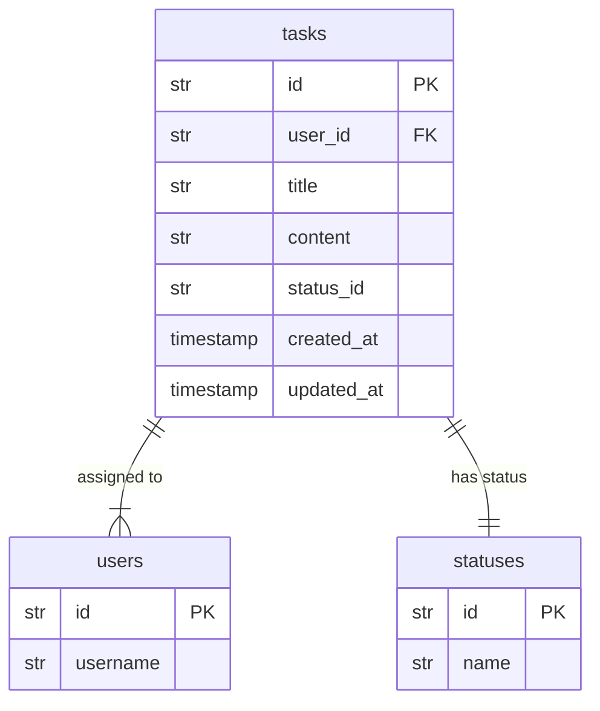

```mermaid
erDiagram
    tasks {
        str id PK 
        str user_id FK
        str title 
        str content
        str status_id 
        timestamp created_at 
        timestamp updated_at 
        }

    users {
        str id PK 
        str username
        }

    statuses {
        str id PK 
        str name 
        } 

    tasks ||--|{ users: "assigned to"
    tasks ||--|| statuses: "has status"
```
